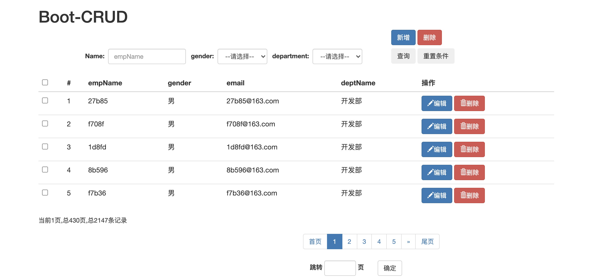

根据`ssm`整合的`crud`，改成了`Springboot`的`crud`，并增加了`admin`登录页。将其中的`MBG`替换成了通用`Mapper`。

并且附上，在学习`SSM_CRUD`整合时的笔记—— [ssm项目整合](./SSM框架的整合项目.md)。可作为`Springboot`及`SSM`入门的`demo`。

相比雷老师原版的`ssm_crud`，现做出以下改进：

1. 框架改用`Springboot`+`mybatis`+`通用mapper`
2. 新增模糊查询、自定义页面跳转
3. 复用模态框(原版写了两个，这里只用了一个)
4. 增设权限登录，即设定login页面
5. Login页面增加国际化工作

主要界面见下图：

1. 登录页面

2. 列表管理页面

3. 项目跑通流程
- 项目中给出了SQL脚本，首先在自己的数据库中运行该脚本即可(脚本最后的**insert操作，只能操作一次**)
- 更改项目中application.yaml和config.properties中的数据库配置文件(改成自己的)
- 运行项目test包中的MapperTest.testCRUD 测试函数，目的制造假数据
- 确保依赖下载完成后，即可启动项目

> 持续更新文档...

